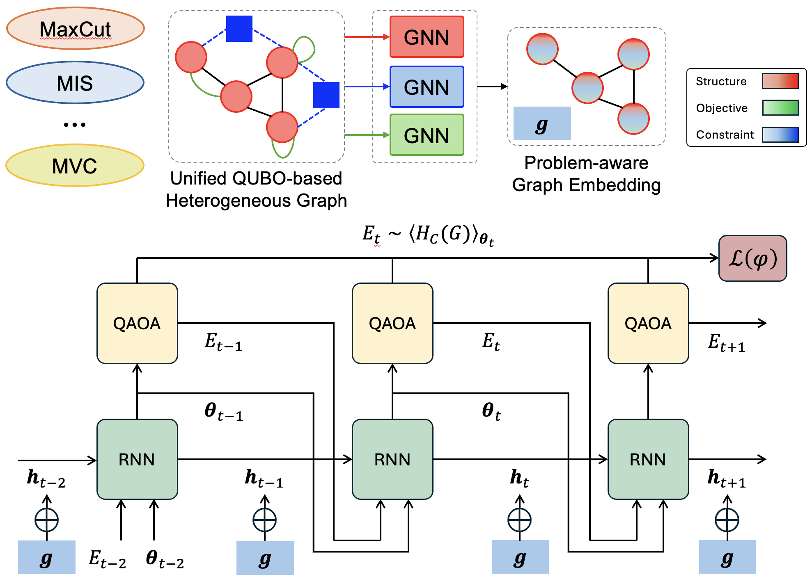
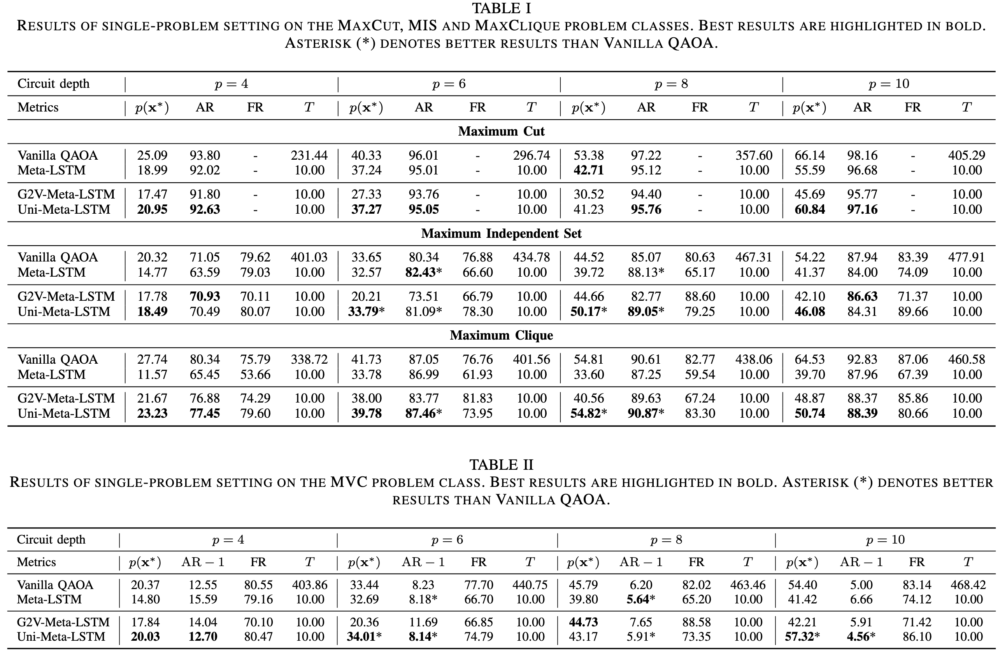
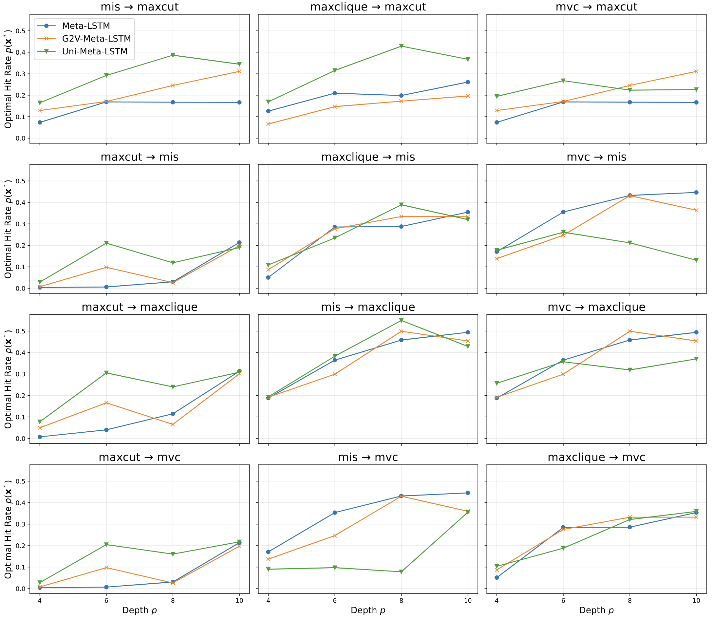

# Graph-Conditioned Meta-Optimizer for QAOA Parameter Generation on Multiple Problem Classes

**Authors:** Kien X. Nguyen, Ilya Safro

The preprint version can be found at [https://arxiv.org/abs/2604.25275](https://arxiv.org/abs/2604.25275).

## Abstract :clipboard:

We study parameter transferability for the Quantum Approximate Optimization Algorithm (QAOA) across multiple combinatorial optimization problem classes from a parameter generation perspective. Specifically, a meta-optimizer is trained on one problem class and deployed on another during test time. Prior work employs a Long Short-Term Memory network to emulate QAOA optimization trajectories, but the learned dynamics usually collapse to near-identical paths, limiting cross-problem transfer efficiency. In this paper, we present a problem-aware graph-conditioned meta-optimizer for QAOA that learns to generate parameter trajectories over a fixed horizon, providing strong initializations with only a few steps. The optimizer is conditioned on compact graph embeddings and trained end-to-end using differentiable feedback from the QAOA objective, avoiding the need for ground-truth angles. We evaluate across multiple graph problem classes, including MaxCut, Maximum Independent Set, Maximum Clique, and Minimum Vertex Cover. We report both solution quality and feasibility-aware metrics where constraints apply. Results across a comprehensive empirical study consisting of 64 settings show that the learned optimizer can reduce optimization effort and improve performance over standard initialization, while exhibiting transferable behavior across graph families and problem types.

<p align="center">

</p>

**Figure.** Overview of the parameter generation procedure. (Top) The problem-aware graph embedding pipeline called UniHetCO that encodes structure, objective and constraint information of the original graph instance on the specified combinatorial problem class. (Bottom) The meta-optimizer conditioned on the graph embedding for generating QAOA parameters over a fixed horizon.

## Data Generation

- The training dataset contains 1000 random graphs. Graph sizes are drawn from $n\in[6,10]$, and edges are generated with probability $p=k/n$ where $k\in[3,n-1]$.
- The testing dataset contains 100 random graphs with $n=12$ and the same edge generating procedure.
- There are four problem classes in this study whose QAOA circuits are defined in `qaoa.py`:
    - Maximum Cut (MaxCut)
    - Maximum Independent Set (MIS)
    - Maximum Clique (MaxClique)
    - Minimum Vertext Cover (MVC)

To create the datasets, run
```
python create_dataset.py
```

This will create a `dataset_l2l/` folder with the following structure:
```
dataset_l2l/
├── trainset/
│   └── graphs.pkl
└── testset/
    └── graphs.pkl
```

### Graph2Vec Embeddings
Next, to create the Graph2Vec embeddings, run
```
python get_g2v.py
```

This requires the `karateclub` package and will result in this structure:
```
dataset_l2l/
├── trainset/
│   └── graphs.pkl
│   └── embeddings.npy
└── testset/
    └── graphs.pkl
    └── embeddings.npy
```

### UniHetCO Embeddings

To get the problem-aware UniHetCO embeddings, navigate to the `unihetco` directory and run the `bash` script
```
cd unihetco/

# Bash script that extracts UniHetCO graph features
./get_unihetco.sh
```

The new `dataset_l2l` structure will look like
```
dataset_l2l/
├── trainset/
│   └── graphs.pkl
│   └── embeddings.npy
│   └── maxcut_unihetco_embeddings.pkl
│   └── mis_unihetco_embeddings.pkl
│   └── maxclique_unihetco_embeddings.pkl
│   └── mvc_unihetco_embeddings.pkl
└── testset/
    └── graphs.pkl
    └── embeddings.npy
    └── maxcut_unihetco_embeddings.pkl
    └── mis_unihetco_embeddings.pkl
    └── maxclique_unihetco_embeddings.pkl
    └── mvc_unihetco_embeddings.pkl
```
Now, everything should be ready for training and testing!

## Evaluation Metrics
We use 3 evaluation metrics in our pipeline: approximation ratio, feasibility rate and optimal hit rate.
Optimal hit rate is particularly appropriate for constrained problems because it evaluates end-to-end solver performance under the same sampling budget for all methods. In contrast, reporting approximation ratios conditioned on feasibility can obscure differences in feasibility rates across methods. Therefore, by directly quantifying the chance of obtaining an optimal feasible solution within the same number of shots, the optimal hit rate provides a fair and practically meaningful comparison when all approaches are evaluated on the same QAOA circuit family and the same measurement budget.

## Training and Testing

To run the training with the unconditioned Learning-to-Learn baseline, execute
```
python train.py 
    --dataset l2l       # dataset name 
    --problem <PROBLEM_CLASS>       # problem class
    --p 4               # num QAOA layers
    --epochs 100 
    --batch-size 32 
    --seed 42 
    --horizon 10 
    --normalize
```
The training script automatically parallelizes the gradient computation of each instance in the batch due to the expensive quantum simulation and gradient tape going from the QAOA expectation value back to the LSTM.

To run the training with the conditioned Graph2Vec embedding, add the `--use-g2v` flag; similarly, `--use-uni` for the conditioned UniHetCO embedding.

The testing script `test.py` has similar flags, so we only need to replace `train.py` with `test.py` to run the testing.

### Results from the paper

<p align="center">

</p>

## Cross-problem Transfer

To perform cross-problem transfer, run the following script.

```
test_transfer.py 
    --dataset l2l 
    --from-problem <FROM_PROBLEM_CLASS> 
    --to-problem <TO_PROBLEM_CLASS> 
    --p 10
    --epochs 100 
    --batch-size 32 
    --seed 42 
    --horizon 10 
    --normalize 
    --test-steps 5
```
### Results from the paper
<p align="center">

</p>

## Reference :pencil2:
If you find this repository useful in your research, please use the following citation:
```
@misc{nguyen2026graphconditionedmetaoptimizerqaoaparameter,
      title={Graph-Conditioned Meta-Optimizer for QAOA Parameter Generation on Multiple Problem Classes}, 
      author={Kien X. Nguyen and Ilya Safro},
      year={2026},
      eprint={2604.25275},
      archivePrefix={arXiv},
      primaryClass={quant-ph},
      url={https://arxiv.org/abs/2604.25275}, 
}
```